# Latent Diffusion Models for Physics Emulation

*Extracted using NVIDIA Nemotron-Parse*

---

## Page 1

arXiv:2507.02608v1 [cs.LG] 3 Jul 2025

# Lost in Latent Space: An Empirical Study of Latent Diffusion Models for Physics Emulation

**Abstract**

The steep computational cost of diffusion models at inference hinders their use as fast physics emulators. In the context of image and video generation, this computational drawback has been addressed by generating in the latent space of an autoencoder instead of the pixel space. In this work, we investigate whether a similar strategy can be effectively applied to the emulation of dynamical systems and at what cost. We find that the accuracy of latent-space emulation is surprisingly robust to a wide range of compression rates (up to \(1000\times\)). We also show that diffusion- based emulators are consistently more accurate than non-generative counterparts and compensate for uncertainty in their predictions with greater diversity. Finally, we cover practical design choices, spanning from architectures to optimizers, that we found critical to train latent-space emulators.

### 1 Introduction

Numerical simulations of dynamical systems are at the core of many scientific and engineering disciplines. Solving partial differential equations (PDEs) that describe the dynamics of physical phenomena enables, among others, weather forecasts [1, 2], predictions of solar wind and flares [3-5], or control of plasma in fusion reactors [6, 7]. These simulations typically operate on fine-grained spatial and temporal grids and require significant computational resources for high-fidelity results.

To address this limitation, a promising strategy is to develop neural network-based emulators to make predictions orders of magnitude faster than traditional numerical solvers. The typical approach [8-17] is to consider the dynamics as a function _f(xi_)=_x__i_+1 that evolves the state _xi_ of the system and to train a neural network \(f_\phi(x)\) to approximate that function. In the context of PDEs, this network is sometimes called a neural solver [11, 18, 19]. After training, the autoregressive application of the solver, or rollout, emulates the dynamics. However, recent studies [11, 18-21] reveal that, while neural solvers demonstrate impressive accuracy for short-term prediction, errors accumulate over the course of the rollout, leading to distribution shifts between training and inference. This phenomenon is even more severe for stochastic or undetermined systems, where it is not possible to predict the next state given the previous one(s) with certainty. Instead of modeling the uncertainty, neural solvers produce a single point estimate, usually the mean, instead of a distribution.

The natural choice to alleviate these issues are generative models, in particular diffusion models, which have shown remarkable results in recent years. Following their success, diffusion models have been applied to emulation tasks [18, 19, 22-25] for which they were found to mitigate the rollout instability of non-generative emulators. However, diffusion models are much more expensive than deterministic alternatives at inference, due to their iterative sampling process, which defeats the purpose of using an emulator. To address this computational drawback, many works in the image and

Preprint. Under review.

François Rozel1, 2, 3 Grabes Louppe3 François Lanusse1, 2, 6 Michael McCabe1, 4

1Polymathic AI 2Flatiron Institute 3University of Liège

4New York University 5Princeton University

6Université Paris-Saclay, Université Paris Cité, CEA, CNRS, AIM

---

## Page 2

<tbc>video generation literature [26-32] consider generating in the latent space of an autoencoder. This approach has been adapted with success to the problem of emulating dynamical systems [33-37], sometimes even outperforming pixel-space emulation. In this work, we seek to answer a simple question: _What is the impact of latent-space compression on emulation accuracy?_ To this end, we train and systematically evaluate latent-space emulators across a wide range of compression rates for challenging dynamical systems from TheWell [38]. Our results indicate that

i. Latent-space emulation is surprisingly robust to the compression rate, even when autoencoder reconstruction quality greatly degrades.<tbc>

ii. Latent-space emulators match or exceed the accuracy of pixel-space emulators, while using fewer parameters and less training compute.<tbc>

iii. Diffusion-based emulators consistently outperform their non-generative counterparts in both accuracy and plausibility of the emulated dynamics.

Finally, we dedicate part of this manuscript to design choices. We discuss architectural and modeling decisions for autoencoders and diffusion models that enable stable training of latent-space emulators under high compression. To encourage further research in this direction, we provide the code for all experiments at `https://github.com/polymathical/lola` along with pre-trained model weights.

## 2 Diffusion models

The primary purpose of diffusion models (DMs) [39, 40], also known as score-based generative models [41, 42], is to generate plausible data from a distribution _p(x_) of interest. Formally, continuous- time diffusion models define a series of increasingly noisy distribuntions<tbc>

\(p(x_t)=\int p(x_t|x)p(x)\mathrm{d}x=\int\mathcal{N}(x_t|\alpha_tx,\sigma_t^2I)p(x)\mathrm{d}x\) (1)

<tbc>such that the ratio \(\alpha_t/\sigma_t\in\mathbb{R}_+\) is monotonically decreasing with the time \(t\in[0,1]\). For such a series, there exists a family of reverse-time stochastic differential equations (SDEs) [42-44]

\(\mathrm{d}x_t=\left[\text{\textit{f}}_tx_t-\frac{1+\eta^2}{2}g_t^2\nabla_{x_t}\mathrm{log}p(x_t)\right]\mathrm{d}t+\eta g_t\mathrm{d}w_t\) (2)

where \(\eta\ge 0\) is a parameter controlling stochasticity, the coefficients _ft_ and _gt_ are derived from \(\alpha_t\) and \(\sigma_t\) [42-44], and for which the variable _xt_ follows _p(xt_). In other words, we can draw noise samples \(x_1\sim p(x_1)\approx\mathcal{N}(0,\sigma_1^2I)\) and obtain data samples _x_0∼_p(x_0)≈_p(x_) by solving Eq. (2) from _t_=1 to 0. For high-dimensional samples, the terminal signal-to-noise ratio \(\alpha_1/\sigma_1\) should be at or very close to zero [45]. In this work, we adopt the rectified flow [28, 46, 47] noise schedule, for which \(\alpha_t=1-t\) and \(\sigma_t=t\).

#### Denoising score matching

In practice, the score function \(\nabla_{x_t}\mathrm{log}p(x_t)\) in Eq. (2) is unknown, but can be approximated by a neural network trained via denoising score matching [48, 49]. Several equivalent parameterizations and objectives have been proposed for this task [40-42, 47, 50, 51]. In this work, we adopt the denoiser parameterization \(d_\phi(x_t,t)\) and its objective [51]

\(\mathrm{argmin}_\phi\mathbb{E}_{p(x)p(t)p(x_t|x)}\left[\lambda_t\left\|d_\phi(x_t,t)-x\right\|_2^2\right],\) (3)

for which the optimal denoiser is the mean E[_x|xt_] of _p(x|xt_). Importantly, E[_x|xt_] is linked to the score function through Tweedie’s formula [52-55]

\(\mathbb{E}[x|x_t]=\frac{x_t+\sigma_t^2\nabla_{x_t}\mathrm{log}p(x_t)}{\alpha_t},\) (4)

which allows to use \(s_\phi(x_t)=\sigma_t^{-2}(d_\phi(x_t,t)-\alpha_tx_t)\) as a score estimate in Eq. (2).

## 3 Methodology

In this section, we detail and motivate our experimental methodology for investigating the impact of compression on the accuracy of latent-space emulators. To summarize, we consider three challenging<tbc>

2

---

## Page 3

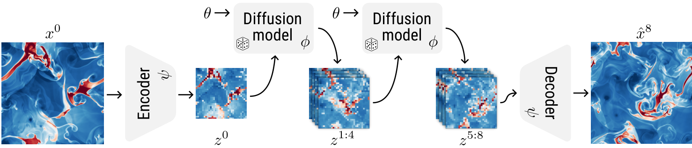
*Figure 1. Illustration of the latent-space emulation process. At each step of the autoregressive rollout, the diffusion model generates the next _n_=4 latent states _z__i_+1:_i+n_ given the current state _zi_ and the simulation parameters \(\theta\). After rollout, the generated latent states are decoded to pixel space.*

<tbc>datasets from TheWell \[38\]. For each dataset, we first train a series of autoencoders with varying compression rates. These autoencoders learn to map high-dimensional physical states \(x^i\in\mathbb{R}^{H\times W\times C_\text{pixel}}\) to low-dimensional latent representations \(z^i\in\mathbb{R}^{\frac{H}{r}\times\frac{W}{r}\times C_\text{latent}}\). Subsequently, for each autoencoder, we train two emulators operating in the latent space: a diffusion model (generative) and a neural solver (non-generative). Both are trained to predict the next _n_ latent states _z__i_+1:_i+n_ given the current latent state _zi_ and simulation parameters \(\theta\). This technique, known as temporal bundling \[11\], mitigates the accumulation of errors during rollout by decreasing the number of required autoregressive steps. After training, latent-space emulators are used to produce autoregressive rollouts _z_1:_L_ starting from known initial state \(z^0=E_\psi(x^0)\) and simulation parameters \(\theta\), which are then decoded to the pixel space as \(\hat{x}^i=D_\psi(z^i)\).

## 3.1 Datasets

To study the effects of extreme compression rates, the datasets we consider should be high-dimensional and contain large amounts of data. Intuitively, the effective size of the dataset decreases in latent space, making overfitting more likely at fixed model capacity. According to these criteria, we select three datasets from TheWell \[38\]. Additional details are provided in Appendix B.

### Euler Multi-Quadrants

The Euler equations model the behavior of compressible non-viscous fluids. In this dataset, the initial state presents multiple discontinuities which result in interacting shock waves as the system evolves for 100 steps. The 2d state of the system is represented with three scalar fields (energy, density, pressure) and one vector field (momentum) discretized on a \(512\times 512\) grid, for a total of \(C_\mathrm{pixel}=5\) channels. Each simulation has either periodic or open boundary conditions and a different heat capacity \(\gamma\), which constitutes their parameters \(\theta\). In order to have noticeable movement between two consecutive states _xi_ and _x__i_+1, we set a time stride \(\Delta=4\) such that the simulation time \(\tau=i\times\Delta\).

### Rayleigh-Bénard (RB)

The Rayleigh-Bénard convection phenomenon occurs when an horizontal layer of fluid is heated from below and cooled from above. Over the 200 simulation steps, the temperature difference leads to the formation of convection currents where cooler fluid sinks and warmer fluid rises. The 2d state of the system is represented with two scalar fields (buoyancy, pressure) and one vector field (velocity) discretized on a \(512\times 128\) grid, for a total of \(C_\text{pixel}=4\) channels. Each simulation has different Rayleigh and Prandtl numbers as parameters \(\theta\). In order to have noticeable movement between two consecutive states _xi_ and _x__i_+1, we set a time stride \(\Delta=4\).

### Turbulence Gravity Cooling (TGC)

The interstellar medium can be modeled as a turbulent fluid subject to gravity and radiative cooling. Starting from an homogeneous state, dense filaments form in the fluid, leading to the birth of stars. The 3d state of the system is represented with three scalar fields (density, pressure, temperature) and one vector field (velocity) discretized on a \(64\times 64\times 64\) grid, for a total of \(C_\text{pixel}=6\) channels. Each simulation has different initial conditions function of their density, temperature, and metallicity. We set a time stride \(\Delta=1\).

## 3.2 Autoencoders

To isolate the effect of compression, we use a consistent autoencoder architecture and training setup across datasets and compression rates. We focus on compressing individual states _xi_ into latent states \(z^i=E_\psi(x^i)\), which are reconstructed as \(\hat{x}^i=D_\psi(z^i)\).

3

---

## Page 4

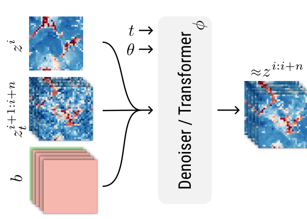
*Figure 2. Illustration of the denoiser’s inputs and outputs, while generating from \(p(z^{i+1:i+n}|z^i,\theta)\).*

### Architecture

We adopt a convolution-based autoencoder architecture similar to the one used by Rombach et al. \[26\], which we adapt to perform well under high compression rates. Specifically, inspired by Chen et al. \[31\], we initialize the downsampling and upsampling layers near identity, which enables training deeper architectures with complex latent representations, while preserving reconstruction quality. For 2d datasets (Euler and RB), we set the spatial downsampling factor _r_=32 for all autoencoders, meaning that a \(32\times 32\) patch in pixel space corresponds to one token in latent space. For 3d datasets (TGC), we set _r_=8. The compression rate is then controlled solely by varying the number of channels per token in the latent representation. For instance, with the Euler dataset, an autoencoder with _C_latent=64 latent channels -`f32c64` in the notations of Chen et al. \[31\] - transforms the input state with shape \(512\times 512\times 5\) to a latent state with shape \(16\times 16\times 64\), yielding a compression rate of 80. This setup ensures that the architectural capacity remains similar for all autoencoders and allows for fair comparison across compression rates. Further details as well as a short ablation study are provided in Appendix B.

### Training

Latent diffusion models \[26\] often rely on a Kullback-Leibler (KL) divergence penalty to encourage latents to follow a standard Gaussian distribution. However, this term is typically down-weighted by several orders of magnitude to prevent severe reconstruction degradation. As such, the KL penalty acts more as a weak regularization than a proper variational objective \[56\] and post-hoc standardization of latents is often necessary. We replace this KL penalty with a deterministic saturating function<tbc>

\(z\mapsto\frac{z}{\sqrt{1+z^2/B^2}}\) (5)

<tbc>applied to the encoder’s output. In our experiments, we choose the bound _B_=5 to mimic the range of a standard Gaussian distribution. We find this approach simpler and more effective at structuring the latent space, without introducing a tradeoff between regularization and reconstruction quality. We additionally omit perceptual \[57\] and adversarial \[58, 59\] loss terms, as they are designed for natural images where human perception is the primary target, unlike physics. The training objective thus simplifies to an _L_1 reconstruction loss

\(argmin_\psi\mathbb{E}_{p(x)}\left[\left\|x-D_\psi(E_\psi(x))\right\|_1\right].\) (6)

Finally, we find that preconditioned optimizers \[60-62\] greatly accelerate the training convergence of autoencoders compared to the widespread Adam \[63\] optimizer (see  4). We adopt the PSGD \[60\] implementation in the `heavyball` \[64\] library for its fewer number of tunable hyper- parameters and lower memory footprint than SOAP \[62\].

## 3.3 Diffusion model

We train diffusion models to predict the next _n_ latent states _z__i_+1:_i+n_ given the current state _zi_ and simulation parameters \(\theta\), that is to generate from \(p(z^{i+1:i+n}|z^i,\theta)\). We parameterize our diffusion models with a denoiser \(d_\phi(z_t^{i:i+n},\theta,t)\) whose task is to denoise sequences of noisy states \(z_t^i\sim p(z_t^i|z^i)=\mathcal{N}(z_t^i|\alpha_tz^i,\sigma_t^2I)\) given the parameters \(\theta\) of the simulation. Conditioning with respect to known elements in the sequence _z__i:i+n_ is tackled with a binary mask \(b\in\{0,1\}^{n+1}\) concatenated to the input. For instance, _b_=(1,0_,...,_0) indicates that the first element _zi_ is known, while _b_=(1_,...,_1,0) indicates that the first _n_-1 elements _z__i:i+n_-1 are known. Known elements are provided to the denoiser without noise.

### Architecture

Drawing inspiration from recent successes in latent image generation \[27-31\], we use a transformer-based architecture for the denoiser. We incorporate several architectural refinements shown to improve performance and stability, including query-key normalization \[65\], rotary positional embedding (RoPE) \[66, 67\], and value residual learning \[68\]. The transformer operates on the spatial and temporal axes of the input \(z_t^{i:i+n}\) , while the parameters \(\theta\) and diffusion time _t_ modulate the transformer blocks. Thanks to the considerable (_r_=32) spatial downsampling performed by the autoencoder, we are able to apply full spatio-temporal attention, avoiding the need for sparse attention<tbc>

4

---

## Page 5

<tbc>patterns \[69-71\]. Finally, we fix the token embedding size (1024) and the number of transformer blocks (16) for all diffusion models. The only architectural variation stems from the number of input and output channels dictated by the corresponding autoencoder.

### Training

As in Section 2, diffusion models are trained via denoising score matching \[48, 49\]

\(argmin_\phi\mathbb{E}_{p(\theta,z^{i:i+n},z_t^{i:i+n})p(b)}\left[\left\|d_\phi(z^{i:i+n}\odot b+z_t^{i:i+n}\odot(1-b),b,\theta,t)-z^{i:i+n}\right\|_2^2\right]\) (7)

with the exception that the data does not come from the pixel-space distribution \(p(\theta,x^{1:L})\) but from the latent-space distribution \(p(\theta,z^{1:L})\) determined by the encoder \(E_\psi\). Following Voleti et al. \[72\], we randomly sample the binary mask _b∼p(b_) during training to cover several conditioning tasks, including prediction with a context _p(z__i_+_c:i+n_|_z__i:i+c_-1) and backward temporal prediction _p(z__i:i+n_-1|_z__i+n_). We find this random masking strategy to slightly improve convergence and generalization \[72, 73\].

### Sampling

After training, we sample from the learned distribution by solving Eq. (2) with \(\eta=0\), which corresponds to the probability flow ODE \[42\]. To this end, we implement a 3rd order Adams- Bashforth multi-step method \[74, 75\]. Intuitively, this method leverages information from previous integration steps to improve accuracy. We find this approach highly effective, producing high- quality samples with significantly fewer neural function evaluations (NFEs) than other widespread samplers \[50, 51\].

## 3.4 Neural solvers

We train neural solvers to perform the same task as diffusion models. Unlike the latter, however, solvers do not generate from \(p(z^{i+1:i+n}|z^i,\theta)\), but produce a point estimate \(f_\phi(z_i,\theta)\approx\mathbb{E}\big[z^{i+1:i+n}|z_i,\theta\big]\) instead. We also train a pixel-space neural solver, for which _zi=xi_, as baseline.

### Architecture

For latent-space neural solvers, we use the same transformer-based architecture as for diffusion models. The only notable difference is that transformer blocks are only modulated with respect to the simulation parameters \(\theta\). For the pixel-space neural solver, we keep the same architecture, but group the pixels into \(16\times 16\) patches, as in vision transformers \[76\]. We also double the token embedding size (2048) such that the pixel-space neural solver has roughly two times more trainable parameters than an autoencoder and latent-space emulator combined.

### Training

Neural solvers are trained via mean regression

\(argmin_\phi\mathbb{E}_{p(\theta,z^{i:i+n})p(b)}\left[\left\|f_\phi(z^{i:i+n}\odot b,b,\theta)-z^{i:i+n}\right\|_2^2\right].\) (8)

Apart from the training objective, the training configuration (optimizer, learning rate schedule, batch size, masking, ...) for neural solvers is strictly the same as for diffusion models.

## 3.5 Evaluation metrics

We consider several metrics for evaluation, each serving a different purpose. We report these metrics either at a lead time \(\tau=i\times\Delta\) or averaged over a lead time horizon _a:b_. If the states _xi_ present several fields, the metric is first computed on each field separately, then averaged.

### Variance-normalized RMSE

The root mean squared error (RMSE) and its normalized variants are widespread metrics to quantify the point-wise accuracy of an emulation \[21, 38, 77\]. Following Ohana et al. \[38\], we pick the variance-normalized RMSE (VRMSE) over the more common normalized RMSE (NRMSE), as the latter down-weights errors in non-negative fields such as pressure and density. Formally, for two spatial fields _u_ and _v_, the VRMSE is defined as

\(VRMSE(u,v)=\sqrt{\frac{\langle(u-v)^2\rangle}{\langle(u-\langle u\rangle)^2\rangle+\epsilon}}\) (9)

where \(\langle\cdot\rangle\) denotes the spatial mean operator and \(\epsilon=10^{-6}\) is a numerical stability term.

5

---

## Page 6

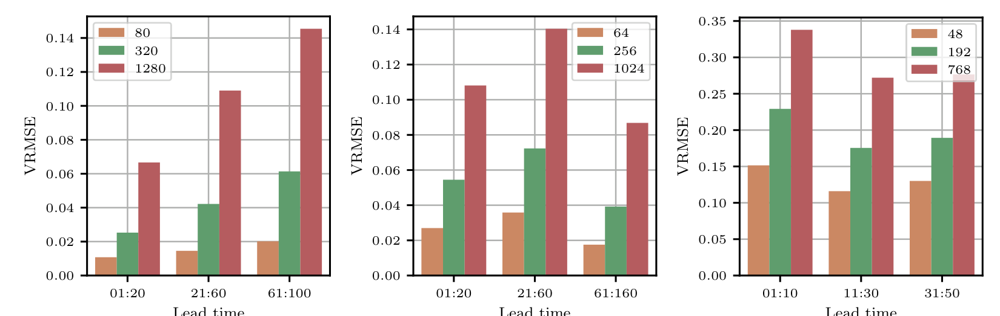
*Figure 3. Average VRMSE of the autoencoder reconstruction at different compression rates and lead time horizons for the Euler (left), RB (center) and TGC (right) datasets. The compression rate has a clear impact on reconstruction quality.*

### Power spectrum RMSE

For chaotic systems such as turbulent fluids, it is typically intractable to achieve accurate long-term emulation as very small errors can lead to entirely different trajectories later on. In this case, instead of reproducing the exact trajectory, emulators should generate diverse trajectories that remain statistically plausible. Intuitively, even though structures are wrongly located, the types of patterns and their distribution should stay similar. Following Ohana et al. [38], we assess statistical plausibility by comparing the power spectra of the ground-truth and emulated trajectories. For two spatial fields _u_ and _v_, we compute the isotropic power spectra _pu_ and _pv_ and split them into three frequency bands (low, mid and high) evenly distributed in log-space. We report the RMSE of the relative power spectra _pv/pu_ over each band.

### Spread-skill ratio

In earth sciences [25, 77], the skill of an ensemble of _K_ particles is defined as the RMSE of the ensemble mean. The spread is defined as the ensemble standard deviation. Under these definitions and the assumption of a perfect forecast where ensemble particles are exchangeable, Fortin et al. [77] show that

\(\text{Skill}\approx\sqrt{K+1/K}\text{Spread}.\) (10)

This motivates the use of the (corrected) spread-skill ratio as a metric. Intuitively, if the ratio is smaller than one, the ensemble is biased or under-dispersed. If the ratio is larger than one, the ensemble is over-dispersed. It should be noted however, that a spread-skill ratio of 1 is a necessary but insufficient condition for a perfect forecast.

## 4 Results

We start with the evaluation of the autoencoders. For all datasets, we train three autoencoders with respectively 64, 16, and 4 latent channels. These correspond to compression rates of 80, 320 and 1280 for the Euler dataset, 64, 256, and 1024 for the RB dataset, and 48, 192, 768 for the TGC dataset, respectively. In the following, we refer to models by their compression rate. Additional experimental details are provided in Section 3 and Appendix B.

For each autoencoder, we evaluate the reconstruction \(\hat{x}^i=D_\psi(E_\psi(x^i))\) of all states _xi_ in 64 test trajectories _x_0:_L_. As expected, when the compression rate increases, the reconstruction quality degrades, as reported in Figure 3. For the Euler dataset, the reconstruction error grows with the lead time due to wavefront interactions and rising high-frequency content. For the RB dataset, the reconstruction error peaks mid-simulation during the transition from low to high-turbulence regime. Similar trends can be observed for the power spectrum RMSE in s 8, 9 and 10, where the high- frequency band is most affected by compression. These results so far align with what practitioners intuitively expect from lossy compression.

We now turn to the evaluation of the emulators. For each autoencoder, we train two latent-space emulators: a diffusion model and a neural solver. Starting from the initial state \(z^0=E_\psi(x^0)\) and simulation parameters \(\theta\) of 64 test trajectories _x_0:_L_, each emulator produces 16 distinct autoregressive rollouts _z_1:_L_, which are then decoded to the pixel space as \(\hat{x}^i=D_\psi(z^i)\). Note that for neural solvers, all 16 rollouts are identical. We compute the metrics of each prediction \(\hat{x}^i\) against the ground-truth state _xi_.

6

---

## Page 7

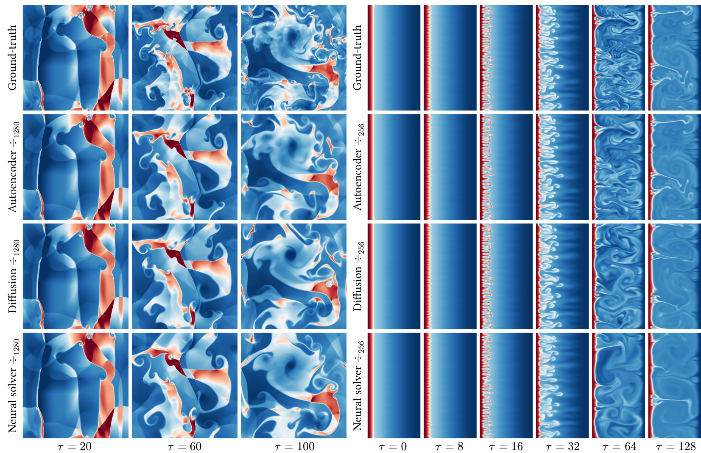
*1. Inference time per state for the Euler dataset, including generation and decoding.*

<tbc>As expected from imperfect emulators, the emulation error grows with the lead time, as shown in Figures 5 and 8. However, the point-wise error of diffusion models and neural solvers, as measured by the VRMSE, remains largely unaffected until extreme (_\>_1000) compression rates are reached. Even then, latent-space emulators outperform the baseline pixel-space neural solver, despite the latter benefiting from more parameters and training compute. Similar observations can be made with the power spectrum RMSE over low and mid-frequency bands. High-frequency content, however, appears limited by the autoencoder’s reconstruction capabilities. We confirm this hypothesis by recomputing the metrics relative to the auto-encoded state \(D_\psi(E_\psi(x^i))\), which we report in Figure 9. This time, the power spectrum RMSE of the diffusion models is low for all frequency bands. These findings support a puzzling narrative: emulation accuracy exhibits strong resilience to latent-space compression, starkly contrasting with the clear degradation in reconstruction quality.

Our experiments also provide a direct comparison between generative (diffusion) and deterministic (neural solver) approaches to emulation within a latent space. Figures 8 and 9 indicate that diffusion-based emulators are consistently more accurate than their deterministic counterparts and generate trajectories that are statistically more plausible in terms of power spectrum. This can be observed qualitatively in Figure 4 or Figures 10 to 21 in Appendix C. In addition, the spread-skill ratio of diffusion models is close to 1, suggesting that the ensemble of trajectories they produce are reasonably well calibrated in terms of diversity/uncertainty. However, the ratio slightly decreases with the compression rate. This phenomenon is partially explained by the smoothing effect of _L_1-driven compression, and is therefore less severe in Figure 9. Nonetheless, it remains present and could be a sign of overfitting due to the reduced amount of training data in latent space.

7

\begin{tabular}{ccc}
Method & Space & Time \\
simulator & pixel & O(10s) \\
neural solver & pixel & 56ms \\
neural solver & latent & 13ms \\
diffusion & pixel & O(1s) \\
diffusion & latent & 84ms \\
\end{tabular}

---

## Page 8

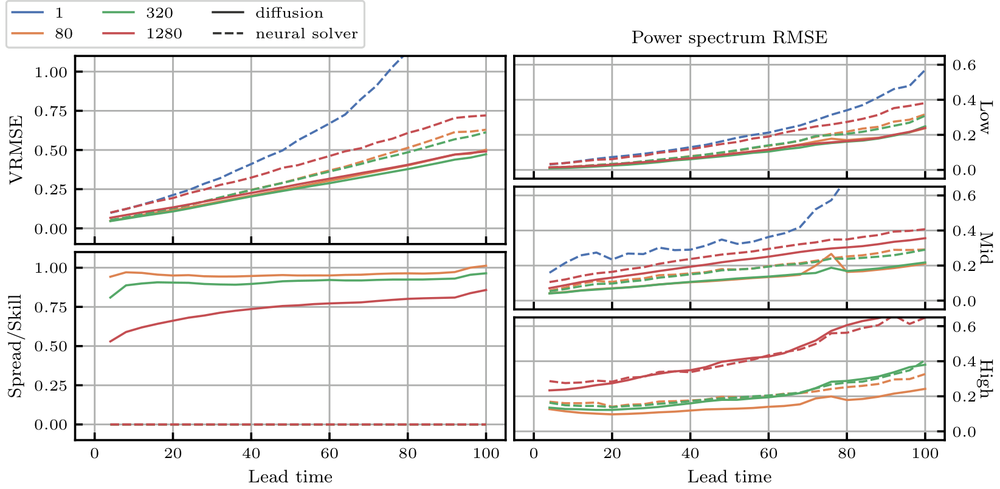
*Figure 5. Average evaluation metrics of latent-space emulation for the Euler dataset. As expected from imperfect emulators, the emulation error grows with the lead time. However, the compression rate has little to no impact on emulation accuracy, beside high-frequency content. The spread-skill ratio [25, 77] drops slightly with the compression rate, which could be a sign of overfitting. The diffusion-based emulators are consistently more accurate than neural solvers.*

In terms of computational cost, although they remain slower than latent-space neural solvers, latent- space diffusion models are much faster than their pixel-space counterparts and competitive with pixel-space neural solvers (see  1). With our latent diffusion models, generating and decoding a full (100 simulation steps, 7 autoregressive steps) Euler trajectory takes 3 seconds on a single A100 GPU, compared to roughly 1 CPU-hour with the original numerical simulation [38, 78].

A final advantage of diffusion models lies in their capacity to incorporate additional information during sampling via guidance methods [42, 79-82]. For example, if partial or noisy state observations are available, we can guide the emulation such that it remains consistent with these observations. We provide an illustrative example in Figure 6 where guidance is performed with the MMPS [79] method. Thanks to the additional information in the observations, the emulation diverges less from the ground-truth.

### 5 Related work

Data-driven emulation of dynamical systems has become a prominent research area [8-17] with diverse applications, including accelerating fluid simulations on uniform meshes using convolutional networks [8, 12], emulating various physics on non-uniform meshes with graph neural networks [9- 11, 14], and solving partial differential equations with neural operators [13, 21, 83-85]. However, McCabe et al. [15] and Herde et al. [16] highlight the large data requirements of these methods and propose pre-training on multiple data-abundant physics before fine-tuning on data-scarce ones to improve data efficiency and generalization. Our experiments similarly suggest that large datasets are needed to train latent-space emulators.

A parallel line of work, related to reduced-order modeling [86], focuses on learning low-dimensional representations of high-dimensional system states. Within this latent space, dynamics can be emulated more efficiently [87-95]. Various embedding approaches have been explored: convolutional autoencoders for uniform meshes [89, 90], graph-based autoencoders for non-uniform meshes [91], and implicit neural representations for discretization-free states [34, 93]. Koopman operator theory [96] has also been integrated into autoencoder training to promote linear latent dynamics [92, 97]. Other approaches to enhance latent predictability include regularizing higher temporal derivatives [98], jointly optimizing the decoder and latent emulator [99], and self-supervised prediction [100]. While our work adopts this latent emulation paradigm, we do not impose structural biases on the latent space beside reconstruction quality.

8

---

## Page 9

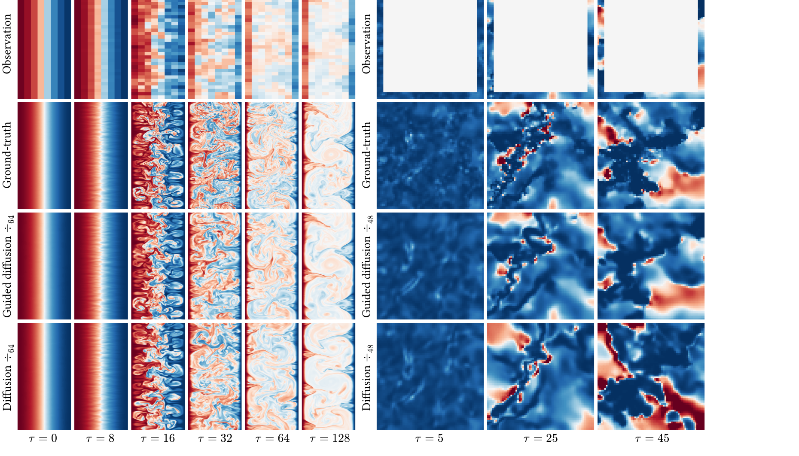
*Figure 6. Example of guided latent-space emulation for the RB (left) and TGC (right) datasets. The observations are the states downsampled by a factor 16 for RB and a stripe along the domain boundaries for TGC. Guidance is performed using the MMPS [79] method. Thanks to the additional information in the observations, the emulation diverges less from the ground-truth.*

A persistent challenge in neural emulation is ensuring temporal stability. Many models, while accurate for short-term prediction, exhibit long-term instabilities as errors accumulate, pushing the predictions out of the training data distribution [21]. Several strategies have been proposed to mitigate this issue: autoregressive unrolling during training [11, 87, 101], architectural modifications [21, 84], noise injection [12], and post-processing [18, 102]. Generative models, particularly diffusion models, have recently emerged as a promising approach to address this problem [18, 19, 22-25] as they produce statistically plausible states, even when they diverge from the ground-truth solution.

While more accurate and stable, diffusion models are computationally expensive at inference. Drawing inspiration from latent space generation in computer vision [26-32], recent studies have applied latent diffusion models to emulate dynamical systems: Gao et al. [33] address short-term precipitation forecasting, Zhou et al. [35] generate trajectories conditioned on text descriptions, Du et al. [34] generate trajectories within an implicit neural representation, and Li et al. [36] combine a state-wise autoencoder with a spatiotemporal diffusion transformer [27] for autoregressive emulation, similar to our approach. These studies report favorable or competitive results against pixel-space and deterministic baselines, consistent with our observations.

## 6 Discussion

Our results reveal key insights about latent physics emulation. First, emulation accuracy is surprisingly robust to latent-space compression, with performance remaining nearly constant even when autoencoder reconstruction quality significantly deteriorates. This observation is consistent with the latent generative modeling literature [26, 56], where compression serves a dual purpose: reducing dimensionality and filtering out perceptually irrelevant patterns that might distract from semantically meaningful information. Our experiments support this hypothesis as latent-space emulators outperform their pixel-space counterparts despite using fewer parameters and requiring less training compute. Yao et al. [103] similarly demonstrate that higher compression can sometimes improve generation quality despite degrading reconstruction. Second, diffusion-based generative emulators consistently achieve higher accuracy than deterministic neural solvers while producing diverse, statistically plausible trajectories.

9

---

## Page 10

<tbc>Despite the limited number of datasets, we believe that our findings are likely to generalize well across the broader spectrum of fluid dynamics. The Euler, RB and TGC datasets represent distinct fluid regimes that cover many key challenges in dynamical systems emulation: nonlinearities, multi-scale interactions, and complex spatio-temporal patterns. In addition, previous studies [33-36] come to similar conclusions for other fluid dynamics problems. However, we exercise caution about extending these conclusions beyond fluids. Systems governed by fundamentally different physics, such as chemical or quantum phenomena, may respond unpredictably to latent compression. Probing these boundaries represents an important direction for future research.

Apart from datasets, if compute resources were not a limiting factor, our study could be extended along several dimensions, although we anticipate that additional experiments would not fundamentally alter our conclusions. First, we could investigate techniques for improving the structure of the latent space, such as incorporating Koopman-inspired losses [92, 97], regularizing temporal derivatives [98], or training shallow auxiliary decoders [103, 104]. Second, we could probe the behavior of different embedding strategies under high compression, including spatio-temporal embeddings [34, 35, 105] and implicit neural representations [34, 93]. Third, we could study the effects of autoencoder and emulator capacity by scaling either up or down their number of trainable parameters. Each of these directions represents a substantial computational investment, particularly given the scale of our datasets and models, but would help establish best practices for latent-space emulation.

Nevertheless, our findings lead to clear recommendations for practitioners wishing to implement physics emulators. First, try latent-space approaches before pixel-space emulation. The former offer reduced computational requirements, lower memory footprint, and comparable or better accuracy across a wide range of compression rates. Second, prefer diffusion-based emulators over deterministic neural solvers. Latent diffusion models provide more accurate, diverse and stable long-term trajectories, while narrowing the inference speed gap significantly.

Our experiments, however, reveal important considerations about dataset scale when training latent- space emulators. The decreasing spread-skill ratio observed at higher compression rates suggests potential overfitting. This makes intuitive sense: as compression increases, the effective size of the dataset in latent space decreases, making overfitting more likely at fixed model capacity. Benchmarking latent emulators on smaller (10-100 GB) datasets like those used by Kohl et al. [19] could therefore yield misleading results. In addition, because the latent space is designed to preserve pixel space content, observing overfitting in this compressed representation suggests that pixel-space models encounter similar issues that remain undetected. This points towards the need for large training datasets or mixtures of datasets used to pre-train emulators before fine-tuning on targeted physics, as advocated by McCabe et al. [15] and Herde et al. [16].

## Acknowledgments and Disclosure of Funding

The authors would like to thank Géraud Krawezik and the Scientific Computing Core at the Flatiron Institute, a division of the Simons Foundation, for the compute facilities and support. We gratefully acknowledge use of the research computing resources of the Empire AI Consortium, Inc., with support from the State of New York, the Simons Foundation, and the Secunda Family Foundation. Polymatic AI acknowledges funding from the Simons Foundation and Schmidt Sciences, LLC.

10

---

## Page 11

## References

[1] ECMWF. "IFS documentation CY49R1 - part III: Dynamics and numerical procedures". In _IFS Documentation CY49R1_. IFS Documentation. ECMWF, 2024.

[2] Jongil Han and Hua-Lu Pan. "Revision of Convection and Vertical Diffusion Schemes in the NCEP Global Forecast System". In _Weather and Forecasting_ 26.4 (2011).

[3] A. J. Hundhausen and R. A. Gentry. "Numerical simulation of flare-generated disturbances in the solar wind". In _Journal of Geophysical Research (1896-1977)_ 74.11 (1969).

[4] John T. Mariska et al. "Numerical Simulations of Impulsively Heated Solar Flares". In _The Astrophysical Journal_ 341 (1989).

[5] Chi Wang et al. "Magnetohydrodynamics (MHD) numerical simulations on the interaction of the solar wind with the magnetosphere: A review". In _Science China Earth Sciences_ 56.7 (2013).

[6] Yuri N. Dnestrovskii and Dimitri P. Kostomarov. "Numerical Simulation of Plasmas". Berlin, Heidelberg: Springer, 1986.

[7] Yildirim Suzen et al. "Numerical Simulations of Plasma Based Flow Control Applications". In _35th AIAA Fluid Dynamics Conference and Exhibit_. Fluid Dynamics and Co-located Conferences. American Institute of Aeronautics and Astronautics, 2005.

[8] Jonathan Tompson et al. "Accelerating Eulerian Fluid Simulation With Convolutional Networks". In _Proceedings of the 34th International Conference on Machine Learning_. PMLR, 2017.

[9] Alvaro Sanchez-Gonzalez et al. "Learning to Simulate Complex Physics with Graph Networks". In _Proceedings of the 37th International Conference on Machine Learning_. PMLR, 2020.

[10] Tobias Pfaff et al. "Learning Mesh-Based Simulation with Graph Networks". In _International Conference on Learning Representations_. 2020.

[11] Johannes Brandstetter et al. "Message Passing Neural PDE Solvers". In _International Conference on Learning Representations_. 2021.

[12] Kim Stachenfeld et al. "Learned Simulators for Turbulence". In _International Conference on Learning Representations_. 2021.

[13] Nikola Kovachki et al. "Neural Operator: Learning Maps Between Function Spaces With Applications to PDEs". In _Journal of Machine Learning Research_ 24.89 (2023).

[14] Remi Lam et al. "Learning skillful medium-range global weather forecasting". In _Science_ 382.6677 (2023).

[15] Michael McCabe et al. "Multiple Physics Pretraining for Spatiotemporal Surrogate Models". In _Advances in Neural Information Processing Systems_. Vol. 37. 2024.

[16] Maximilian Herde et al. "Poseidon: Efficient Foundation Models for PDEs". In _Advances in Neural Information Processing Systems_. Vol. 37. 2024.

[17] Rudy Morel et al. "DISCO: learning to DISCover an evolution Operator for multi-physics- agnostic prediction". 2025.

[18] Phillip Lippe et al. "PDE-Refiner: Achieving Accurate Long Rollouts with Neural PDE Solvers". In _Advances in Neural Information Processing Systems_. Vol. 36. 2023.

[19] Georg Kohl et al. "Benchmarking Autoregressive Conditional Diffusion Models for Turbulent Flow Simulation". In _ICML 2024 AI for Science Workshop_. 2024.

[20] Björn List et al. "Learning turbulence modelling with differentiable fluid solvers: physics- based loss functions and optimisation horizons". In _Journal of Fluid Mechanics_ 949 (2022).

[21] Michael McCabe et al. "Towards Stability of Autoregressive Neural Operators". In _Transactions on Machine Learning Research_ (2023).

[22] Salva Cachay et al. "DYFFusion: A Dynamics-informed Diffusion Model for Spatiotemporal Forecasting". In _Advances in Neural Information Processing Systems_. Vol. 36. 2023.

[23] Aliaksandra Shysheya et al. "On conditional diffusion models for PDE simulations". In _Advances in Neural Information Processing Systems_. Vol. 37. 2024.

[24] Jiahe Huang et al. "DiffusionPDE: Generative PDE-Solving under Partial Observation". In _Advances in Neural Information Processing Systems_. Vol. 37. 2024.

11

---

## Page 12

[25] Ilan Price et al. "Probabilistic weather forecasting with machine learning". In _Nature_ 637.8044 (2025).

[26] Robin Rombach et al. "High-Resolution Image Synthesis With Latent Diffusion Models". In _Conference on Computer Vision and Pattern Recognition_. 2022.

[27] William Peebles and Saining Xie. "Scalable Diffusion Models with Transformers". In _International Conference on Computer Vision_. 2023.

[28] Patrick Esser et al. "Scaling Rectified Flow Transformers for High-Resolution Image Synthesis". 2024.

[29] Tero Karras et al. "Analyzing and Improving the Training Dynamics of Diffusion Models". In _Proceedings of the IEEE/CVF Conference on Computer Vision and Pattern Recognition_. 2024.

[30] Enze Xie et al. "SANA: Efficient High-Resolution Text-to-Image Synthesis with Linear Diffusion Transformers". In _International Conference on Learning Representations_. 2024.

[31] Junyu Chen et al. "Deep Compression Autoencoder for Efficient High-Resolution Diffusion Models". In _International Conference on Learning Representations_. 2024.

[32] Adam Polyak et al. "Movie Gen: A Cast of Media Foundation Models". 2025.

[33] Zihihan Gao et al. "PreDiff: Precipitation Nowcasting with Latent Diffusion Models". In _Thirty-seventh Conference on Neural Information Processing Systems_. 2023.

[34] Pan Du et al. "Conditional neural field latent diffusion model for generating spatiotemporal turbulence". In _Nature Communications_ 15.1 (2024).

[35] Anthony Zhou et al. "Text2PDE: Latent Diffusion Models for Accessible Physics Simulation". In _The Thirteenth International Conference on Learning Representations_. 2024.

[36] Zijie Li et al. "Generative Latent Neural PDE Solver using Flow Matching". 2025.

[37] Gérôme Andry et al. "Appa: Bending Weather Dynamics with Latent Diffusion Models for Global Data Assimilation". 2025.

[38] Ruben Ohana et al. "The Well: a Large-Scale Collection of Diverse Physics Simulations for Machine Learning". In _Advances in Neural Information Processing Systems_. Vol. 37. 2024.

[39] Jascha Sohl-Dickstein et al. "Deep Unsupervised Learning using Nonequilibrium Thermodynamics". In _Proceedings of the 32nd International Conference on Machine Learning_. 2015.

[40] Jonathan Ho et al. "Denoising Diffusion Probabilistic Models". In _Advances in Neural Information Processing Systems_. 2020.

[41] Yong Song and Stefano Ermon. "Generative Modeling by Estimating Gradients of the Data Distribution". In _Advances in Neural Information Processing Systems_. 2019.

[42] Yang Song et al. "Score-Based Generative Modeling through Stochastic Differential Equations". In _International Conference on Learning Representations_. 2021.

[43] Brian D. O. Anderson. "Reverse-time diffusion equation models". In _Stochastic Processes and their Applications_ (1982).

[44] Simo Särkä and Arno Solin. "Applied Stochastic Differential Equations". Institute of Mathematical Statistics Textbooks. Cambridge University Press, 2019.

[45] Shanchuan Lin et al. "Common Diffusion Noise Schedules and Sample Steps are Flawed". In _2024 IEEE/CVF Winter Conference on Applications of Computer Vision (WACV)_. 2024.

[46] Xingchao Liu et al. "Flow Straight and Fast: Learning to Generate and Transfer Data with Rectified Flow". In _The Eleventh International Conference on Learning Representations_. 2022.

[47] Yaron Lipman et al. "Flow Matching for Generative Modeling". In _International Conference on Learning Representations_. 2023.

[48] Aapo Hyvärinen. "Estimation of Non-Normalized Statistical Models by Score Matching". In _Journal of Machine Learning Research_ (2005).

[49] Pascal Vincent. "A Connection Between Score Matching and Denoising Autoencoders". In _Neural Computation_ (2011).

[50] Jiaming Song et al. "Denoising Diffusion Implicit Models". In _International Conference on Learning Representations_. 2021.

12

---

## Page 13

[51] Toro Karras et al. "Elucidating the Design Space of Diffusion-Based Generative Models". In _Advances in Neural Information Processing Systems_. 2022.

[52] M. C. K. Tweedie. "Functions of a statistical variate with given means, with special reference to Laplacian distributions". In _Mathematical Proceedings of the Cambridge Philosophical Society_ (1947).

[53] Bradley Efron. "Tweedie’s  and Selection Bias". In _Journal of the American Statistical Association_ (2011).

[54] Kwanyoung Kim and Jong Chul Ye. "Noise2Score: Tweedie’s Approach to Self-Supervised Image Denoising without Clean Images". In _Advances in Neural Information Processing Systems_. 2021.

[55] Chenlin Meng et al. "Estimating High Order Gradients of the Data Distribution by Denoising". In _Advances in Neural Information Processing Systems_. 2021.

[56] Sander Dieleman. "Generative modelling in latent space". 2025.

[57] Richard Zhang et al. "The Unreasonable Effectiveness of Deep Features as a Perceptual Metric". In _Conference on Computer Vision and Pattern Recognition_. 2018.

[58] Ian J. Goodfellow et al. "Generative Adversarial Networks". 2014.

[59] Patrick Esser et al. "Taming Transformers for High-Resolution Image Synthesis". In _Proceedings of the IEEE/CVF Conference on Computer Vision and Pattern Recognition_. 2021.

[60] Xi-Lin Li. "Preconditioned Stochastic Gradient Descent". In _IEEE Transactions on Neural Networks and Learning Systems_ 29.5 (2018).

[61] Vineet Gupta et al. "Shampoo: Preconditioned Stochastic Tensor Optimization". In _Proceedings of the 35th International Conference on Machine Learning_. PMLR, 2018.

[62] Nikhil Vyas et al. "SOAP: Improving and Stabilizing Shampoo using Adam for Language Modeling". In _The Thirteenth International Conference on Learning Representations_. 2024.

[63] Diederik P. Kingma and Jimmy Ba. "Adam: A Method for Stochastic Optimization". In _International Conference on Learning Representations_. 2015.

[64] Lucas Nestler and François Rozet. "HeavyBall: Efficient optimizers". 2022.

[65] Alex Henry et al. "Query-Key Normalization for Transformers". In _Findings of the Association for Computational Linguistics_. Ed. by Trevor Cohn et al. Online: Association for Computational Linguistics, 2020.

[66] Jianlin Su et al. "RoFormer: Enhanced transformer with Rotary Position Embedding". In _Neurocomputing_ 568 (2024).

[67] Byeongho Heo et al. "Rotary Position Embedding for Vision Transformer". In _European Conference on Computer Vision_. Ed. by Aleș Leonardis et al. Cham: Springer Nature Switzerland, 2025.

[68] Zhanchao Zhou et al. "Value Residual Learning". 2025.

[69] Zilong Huang et al. "CCNet: Criss-Cross Attention for Semantic Segmentation". In _Proceedings of the IEEE/CVF International Conference on Computer Vision_. 2019.

[70] Jonathan Ho et al. "Axial Attention in Multidimensional Transformers". 2019.

[71] Ali Hassani et al. "Neighborhood Attention Transformer". In _Proceedings of the IEEE/CVF Conference on Computer Vision and Pattern Recognition_. 2023.

[72] Vikram Voleti et al. "MCVD - Masked Conditional Video Diffusion for Prediction, Generation, and Interpretation". In _Advances in Neural Information Processing Systems_ 35 (2022).

[73] Hongkai Zheng et al. "Fast Training of Diffusion Models with Masked Transformers". In _Transactions on Machine Learning Research_ (2023).

[74] Ernst Hairer et al. "Solving Ordinary Differential Equations I". Vol. 8. Springer Series in Computational Mathematics. Berlin, Heidelberg: Springer, 1993.

[75] Qinsheng Zhang and Yongxin Chen. "Fast Sampling of Diffusion Models with Exponential Integrator". In _International Conference on Learning Representations_. 2022.

[76] Alexey Dosovitskiy et al. "An Image is Worth 16x16 Words: Transformers for Image Recognition at Scale". In _International Conference on Learning Representations_. 2020.

[77] V. Fortin et al. "Why Should Ensemble Spread Match the RMSE of the Ensemble Mean?" In _Journal of Hydrometeorology_ 15.4 (2014).

13

---

## Page 14

[78] Kyle T. Mandli et al. “Clawpack: building an open source ecosystem for solving hyperbolic PDEs”. In _PeerJ Computer Science_ 2 (2016).

[79] François Rozet et al. “Learning Diffusion Priors from Observations by Expectation Maximization”. In _Advances in Neural Information Processing Systems_. Vol. 37. 2024.

[80] Jonathan Ho et al. “Video Diffusion Models”. In _ICLR Workshop on Deep Generative Models for Highly Structured Data_. 2022.

[81] Hyungjin Chung et al. “Diffusion Posterior Sampling for General Noisy Inverse Problems”. In _International Conference on Learning Representations_. 2023.

[82] François Rozet and Gilles Louppe. “Score-based Data Assimilation”. In _Advances in Neural Information Processing Systems_. Vol. 36. 2023.

[83] Zongyi Li et al. “Fourier Neural Operator for Parametric Partial Differential Equations”. In _International Conference on Learning Representations_. 2020.

[84] Bogdan Raonic et al. “Convolutional Neural Operators for robust and accurate learning of PDEs”. In _Advances in Neural Information Processing Systems_. Vol. 36. 2023.

[85] Zhongkai Hao et al. “GNOT: A General Neural Operator Transformer for Operator Learning”. In _Proceedings of the 40th International Conference on Machine Learning_. PMLR, 2023.

[86] Peter Benner et al. “A Survey of Projection-Based Model Reduction Methods for Parametric Dynamical Systems”. In _SIAM Review_ 57.4 (2015).

[87] Bethany Lusch et al. “Deep learning for universal linear embeddings of nonlinear dynamics”. In _Nature Communications_ 9.1 (2018).

[88] Hugo F. S. Lui and William R. Wolf. “Construction of reduced-order models for fluid flows using deep feedforward neural networks”. In _Journal of Fluid Mechanics_ 872 (2019).

[89] S. Wiewel et al. “Latent Space Physics: Towards Learning the Temporal Evolution of Fluid Flow”. In _Computer Graphics Forum_ 38.2 (2019).

[90] Romit Maulik et al. “Reduced-order modeling of advection-dominated systems with recurrent neural networks and convolutional autoencoders”. In _Physics of Fluids_ 33.3 (2021).

[91] Xu Han et al. “Predicting Physics in Mesh-reduced Space with Temporal Attention”. In _International Conference on Learning Representations_. 2021.

[92] Nicholas Geneva and Nicholas Zabaras. “Transformers for modeling physical systems”. In _Neural Networks_ 146 (2022).

[93] Peter Yichen Chen et al. “CROM: Continuous Reduced-Order Modeling of PDEs Using Implicit Neural Representations”. In _The Eleventh International Conference on Learning Representations_. 2022.

[94] AmirPouya Hemmasian and Amir Barati Farimani. “Reduced-order modeling of fluid flows with transformers”. In _Physics of Fluids_ 35.5 (2023).

[95] Zijie Li et al. “Latent neural PDE solver: A reduced-order modeling framework for partial differential equations”. In _Journal of Computational Physics_ 524 (2025).

[96] B. O. Koopman. “Hamiltonian Systems and Transformation in Hilbert Space”. In _Proceedings of the National Academy of Sciences_ 17.5 (1931).

[97] Enoch Yeung et al. “Learning Deep Neural Network Representations for Koopman Operators of Nonlinear Dynamical Systems”. In _2019 American Control Conference (ACC)_. 2019.

[98] Xiaoyu Xie et al. “Smooth and Sparse Latent Dynamics in Operator Learning with Jerk Regularization”. 2024.

[99] Francesco Regazzoni et al. “Learning the intrinsic dynamics of spatio-temporal processes through Latent Dynamics Networks”. In _Nature Communications_ 15.1 (2024).

[100] Adrien Bardes et al. “Revisiting Feature Prediction for Learning Visual Representations from Video”. In _Transactions on Machine Learning Research_ (2024).

[101] Nicholas Geneva and Nicholas Zabaras. “Modeling the dynamics of PDE systems with physics-constrained deep auto-regressive networks”. In _Journal of Computational Physics_ 403 (2020).

[102] Daniel E. Worrall et al. “Spectral Shaping for Neural PDE Surrogates”. 2024.

[103] Jingfeng Yao et al. “Reconstruction vs. Generation: Taming Optimization Dilemma in Latent Diffusion Models”. 2025.

14

---

## Page 15

[104] Hao Chen et al. "Masked Autoencoders Are Effective Tokenizers for Diffusion Models". 2025.

[105] Lijun Yu et al. "MAGVIT: Masked Generative Video Transformer". In _Proceedings of the IEEE/CVF Conference on Computer Vision and Pattern Recognition_. 2023.

[106] Keaton J. Burns et al. "Dedalus: A flexible framework for numerical simulations with spectral methods". In _Physical Review Research_ 2.2 (2020).

[107] Masaki Iwasawa et al. "Implementation and performance of FDPS: a framework for developing parallel particle simulation codes". In _Publications of the Astronomical Society of Japan_ 68.4 (2016).

[108] Kaiming He et al. "Deep Residual Learning for Image Recognition". In _Conference on Computer Vision and Pattern Recognition_. 2016.

[109] Stefan Elfwing et al. "Sigmoid-weighted linear units for neural network function approximation in reinforcement learning". In _Neural Networks_ (2018).

[110] Jimmy Lei Ba et al. "Layer Normalization". 2016. Wildlife State Activity 2016 (February 2017). Information for SUPER Format 1A Quadroology 2-13-16.

15

---

## Page 16

## A Spread / Skill

The skill [25, 77] of an ensemble of _K_ particles _vk_ is defined as the RMSE of the ensemble mean

\(\text{Skill}=\sqrt{\left\langle\left(u-\frac{1}{K}\sum_{k=1}^Kv_k\right)^2\right\rangle}\) (11)

where \(\langle\cdot\rangle\) denotes the spatial mean operator. The spread is defined as the ensemble standard deviation

\(\text{Spread}=\sqrt{\left\langle\frac{1}{K-1}\sum_{j=1}^K\left(v_j-\frac{1}{K}\sum_{k=1}^Kv_k\right)^2\right\rangle}.\) (12)

Under these definitions and the assumption of a perfect forecast where ensemble particles are exchangeable, Fortin et al. [77] show that

\(\text{Skill}\approx\sqrt{\frac{K+1}{K}}\text{Spread}.\) (13)

This motivates the use of the (corrected) spread-skill ratio as a metric. Intuitively, if the ratio is smaller than one, the ensemble is biased or under-dispersed. If the ratio is larger than one, the ensemble is over-dispersed. It should be noted however, that a spread-skill ratio of 1 is a necessary but not sufficient condition for a perfect forecast.

16

---

## Page 17

## B Experiment details

#### Datasets

For all datasets, each field is standardized with respect to its mean and variance over the training set. For Euler, the non-negative scalar fields (energy, density, pressure) are transformed with \(x\mapsto log(x+1)\) before standardization. For TGC, the non-negative scalar fields (density, pressure, temperature) are transformed with \(x\mapsto log(x+10^{-6})\) before standardization. When the states are illustrated graphically, as in Figure 1, we represent the density field for Euler, the buoyancy field for RB, and a slice of the temperature field for TGC.

#### Autoencoders

The encoder \(E_\psi\) and decoder \(D_\psi\) are convolutional networks with residual blocks \[108\], SiLU \[109\] activation functions and layer normalization \[110\]. A multi-head self-attention layer \[111\] is inserted in some residual blocks. The output of the encoder is transformed with a saturating function (see Section 3). We provide a schematic illustration of the autoencoder architecture in Figure 7. We train the encoder and decoder jointly for \(1024\times 256\) steps of the PSGD \[60\] optimizer. To mitigate overfitting we use random spatial axes permutations, flips and rolls as data augmentation. Each autoencoder takes 1 (RB), 2 (Euler) or 4 (TGC) days to train on 8 H100 GPUs. Other hyperparameters are provided in  3.

17

\begin{tabular}{cccc}
 & Euler Multi-Quadrants & Rayleigh-Bénard & Turbulence Gravity Cooling \\
Software & Clawpack \[78\] & Dedalus \[106\] & FDPS \[107\] \\
Size & 5243 GB & 367 GB & 849 GB \\
\multirow{2}{*}{Fields} & energy, density, & buoyancy, pressure, & density, pressure, \\
 & pressure, velocity & momentum & temperature, velocity \\
Channels _C_pixel & 5 & 4 & 6 \\
Resolution & \(512\times 512\) & \(512\times 128\) & \(64\times 64\times 64\) \\
Discretization & Uniform & Chebyshev & Uniform \\
Trajectories & 10000 & 1750 & 2700 \\
Time steps _L_ & 100 & 200 & 50 \\
Stride \(\Delta\) & 4 & 4 & 1 \\
\multirow{2}{*}{\(\theta\)} & heat capacity \(\gamma\), & Rayleigh number, & hydrogen density \(\rho_0\), \\
 & boundary conditions & Prandtl number & temperature _T_0, metallicity _Z_ \\
\end{tabular}

\begin{tabular}{ccc}
 & Euler \& RB & TGC \\
Architecture & Conv & Conv \\
Parameters & \(2.4\times 10^8\) & \(7.2\times 10^8\) \\
Pixel shape & \(C_\text{pixel}\times H\times W\) & \(C_\text{pixel}\times H\times W\times Z\) \\
Latent shape & \(C_\text{latent}\times\frac{H}{32}\times\frac{W}{32}\) & \(C_\text{latent}\times\frac{H}{8}\times\frac{W}{8}\times\frac{Z}{8}\) \\
Residual blocks per level & (3, 3, 3, 3, 3, 3, 3 ) & (3, 3, 3, 3 ) \\
Channels per level & (64, 128, 256, 512, 768, 1024) & (64, 256, 512, 1024) \\
Attention heads per level & (-, -, -, -, -, -, 8) & (-, -, -, - - ) \\
Kernel size & \(3\times 3\) & \(3\times 3\times 3\) \\
Activation & SiLU & SiLU \\
Normalization & LayerNorm & LayerNorm \\
Dropout & 0.05 & 0.05 \\
Optimizer & PSGD & PSGD \\
Learning rate & 10-5 & 10-5 \\
Weight decay & 0.0 & 0.0 \\
Scheduler & cosine & cosine \\
Gradient norm clipping & 1.0 & 1.0 \\
Batch size & 64 & 64 \\
Steps per epoch & 256 & 256 \\
Epochs & 1024 & 1024 \\
GPUs & 8 & 8 \\
\end{tabular}

2. Details of the selected datasets. We refer the reader to Ohana et al. \[38\] for more information.

3. Hyperparameters for the autoencoders.

---

## Page 18

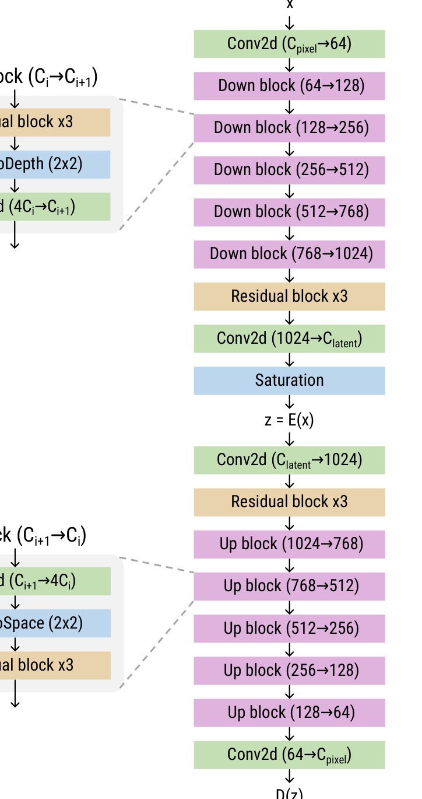
*Figure 7. Schematic representation of the autoencoder architecture. Downsampling (resp. upsampling) is performed with a space-to-depth (resp. depth-to-space) operation followed (resp. preceded) with a convolution initialized near identity.*

4. Short ablation study on the autoencoder architecture and training configurations. We pick the Rayleigh-Bénard dataset and an architecture with 64 latent channels to perform this study. The two major modifications that we propose are (1) the initialization of the downsampling and upsampling layers near identity, inspired by Chen et al. \[31\], and (2) the use of a preconditioned optimizer, PSGD \[60\], instead of Adam \[63\]. We report the mean absolute error (MAE) on the validation set during training. The combination of both proposed modifications leads to order(s) of magnitude faster convergence.

## Caching

The entire dataset is encoded with each trained autoencoder and the resulting latent trajectories are cached permanently on disk. The latter can then be used to train latent-space emulators, without needing to load and encode high-dimensional samples on the fly. Depending on hardware and data dimensionality, this approach can make a huge difference in I/O efficiency.

## Emulators

The denoiser \(d_\phi\) and neural solver \(f_\phi\) are transformers with query-key normalization \[65\], rotary positional embedding (RoPE) \[66, 67\], and value residual learning \[68\]. The 16 blocks are modulated by the simulation parameters \(\theta\) and the diffusion time _t_, as in diffusion transformers<tbc>

18

\begin{tabular}{cccccc}
\multirow{2}{*}{Optimizer} & \multirow{2}{*}{Id. init} & \multicolumn{3}{c}{Epoch} & \multirow{2}{*}{Time} \\
 & & 10 & 100 & 1000 & \\
Adam & w/o & 0.065 & 0.029 & 0.017 & 19 h \\
Adam & w/ & 0.039 & 0.023 & 0.014 & 19 h \\
PSGD & w/ & 0.023 & 0.015 & 0.011 & 25 h \\
\end{tabular}

---

## Page 19

<tbc>\[27\]. We train the emulator for \(4096\times 64\) steps of the Adam \[63\] optimizer. Each latent-space emulator takes 2 (RB) or 5 (Euler, TGC) days to train on 8 H100 GPUs. Each pixel-space emulator takes 5 (RB) or 10 (Euler) days to train on 16 H100 GPUs. We do not train a pixel-space emulator for TGC. Other hyperparameters are provided in  5.

5. Hyperparameters for the emulators.

During training we randomly sample the binary mask _b_. The number of context elements _c_ follows a Poisson distribution \(Pois(\lambda=2)\) truncated between 1 and _n_. In addition, we randomly flip _b_ with probability 0.33 to cover backward temporal prediction. Hence, the masks _b_ take the form

\(b=\underbrace{(1,\dots,1,0,\dots,0)}_c\text{or}b=(0,\dots,0,\underbrace{1,\dots,1,\dots}_c)\) (14)

implicitely defining a distribution _p(b_).

**Evaluation** For each dataset, we randomly select 64 trajectories _x_0:_L_ with various parameters \(\theta\) in the test set. For each latent-space emulator, we encode the initial state \(z_0=E_\psi(x_0)\) and produce 16 distinct autoregressive rollouts _z_1:_L_. For the diffusion models, sampling is performed with 16 steps of the 3rd order Adams-Bashforth multi-step method \[74, 75\]. The metrics (VRMSE, power spectrum RMSE, spread-skill ratio) are then measured between the predicted states \(\hat{x}^i=D_\psi(z^i)\) and the ground-truth states _xi_ or the auto-encoded states \(D_\psi(E_\psi(x^i))\).

19

\begin{tabular}{ccc}
 & Latent-space & Pixel-space \\
Architecture & Transformer & Transformer \\
Parameters & \(2.2\times 10^8\) & \(8.6\times 10^8\) \\
Input shape & \(C_\text{latent}\times n+1\times\frac{H}{32}\times\frac{W}{32}\) & \(C_\text{pixel}\times n+1\times H\times W\) \\
Patch size & \(1\times 1\times 1\) & \(1\times 16\times 16\) \\
Tokens & \(n+1\times\frac{H}{32}\times\frac{W}{32}\) & \(n+1\times\frac{H}{16}\times\frac{W}{16}\) \\
Embedding size & 1024 & 2048 \\
Blocks & 16 & 16 \\
Positional embedding & Absolute + RoPE & Absolute + RoPE \\
Activation & SiLU & SiLU \\
Normalization & LayerNorm & LayerNorm \\
Dropout & 0.05 & 0.05 \\
Optimizer & Adam & Adam \\
Learning rate & 10-4 & 10-4 \\
Weight decay & 0.0 & 0.0 \\
Scheduler & cosine & cosine \\
Gradient norm clipping & 1.0 & 1.0 \\
Batch size & 256 & 256 \\
Steps per epoch & 64 & 64 \\
Epochs & 4096 & 4096 \\
GPUs & 8 & 16 \\
\end{tabular}

---

## Page 20

## C Additional results

20

\begin{tabular}{ccccc}
\multirow{2}{*}{Method} & \multicolumn{3}{c}{Euler} & \\
 & ÷ & 1:20 & 21:60 & 61:100 \\
\multirow{3}{*}{autoencoder} & 80 & 0.011 & 0.015 & 0.020 \\
 & 320 & 0.025 & 0.042 & 0.061 \\
 & 1280 & 0.067 & 0.109 & 0.145 \\
\multirow{3}{*}{diffusion} & 80 & 0.075 & 0.199 & 0.395 \\
 & 320 & 0.070 & 0.192 & 0.371 \\
 & 1280 & 0.093 & 0.217 & 0.400 \\
\multirow{4}{*}{neural solver} & 1 & 0.138 & 0.397 & 1.102 \\
 & 80 & 0.077 & 0.232 & 0.500 \\
 & 320 & 0.080 & 0.232 & 0.476 \\
 & 1280 & 0.137 & 0.314 & 0.592 \\
\end{tabular}

\begin{tabular}{ccccc}
\multirow{2}{*}{Method} & \multicolumn{3}{c}{RB} & \\
 & ÷ & 1:20 & 21:60 & 61:160 \\
\multirow{3}{*}{autoencoder} & 64 & 0.027 & 0.036 & 0.018 \\
 & 256 & 0.054 & 0.072 & 0.039 \\
 & 1024 & 0.108 & 0.140 & 0.087 \\
\multirow{3}{*}{diffusion} & 64 & 0.157 & 0.469 & 0.625 \\
 & 256 & 0.177 & 0.474 & 0.621 \\
 & 1024 & 0.219 & 0.507 & 0.657 \\
\multirow{4}{*}{neural solver} & 1 & 0.245 & 0.629 & 0.870 \\
 & 64 & 0.219 & 0.645 & 0.828 \\
 & 256 & 0.235 & 0.651 & 0.834 \\
 & 1024 & 0.256 & 0.644 & 0.827 \\
\end{tabular}

\begin{tabular}{ccccc}
\multirow{2}{*}{Method} & \multicolumn{4}{c}{TGC} \\
 & ÷ & 1:10 & 11:20 & 21:50 \\
\multirow{3}{*}{autoencoder} & 48 & 0.151 & 0.116 & 0.129 \\
 & 192 & 0.229 & 0.175 & 0.189 \\
 & 768 & 0.338 & 0.272 & 0.276 \\
\multirow{3}{*}{diffusion} & 48 & 0.297 & 0.523 & 0.675 \\
 & 192 & 0.342 & 0.527 & 0.665 \\
 & 768 & 0.425 & 0.575 & 0.694 \\
\multirow{4}{*}{neural solver} & 48 & 0.302 & 0.599 & 0.826 \\
 & 192 & 0.361 & 0.632 & 0.835 \\
 & 768 & 0.462 & 0.710 & 0.920 \\
\end{tabular}

\begin{tabular}{ccccc}
\multirow{2}{*}{Method} & \multicolumn{3}{c}{Euler} & \\
 & _c_ & 1:20 & 21:60 & 61:100 \\
\multirow{3}{*}{diffusion} & 1 & 0.085 & 0.204 & 0.393 \\
 & 2 & 0.074 & 0.201 & 0.383 \\
 & 3 & 0.078 & 0.203 & 0.389 \\
\multirow{3}{*}{neural solver} & 1 & 0.108 & 0.266 & 0.526 \\
 & 2 & 0.092 & 0.253 & 0.513 \\
 & 3 & 0.094 & 0.260 & 0.529 \\
\end{tabular}

\begin{tabular}{ccccc}
\multirow{2}{*}{Method} & \multicolumn{4}{c}{RB} \\
 & _c_ & 1:20 & 21:60 & 61:160 \\
\multirow{3}{*}{diffusion} & 1 & 0.186 & 0.486 & 0.635 \\
 & 2 & 0.184 & 0.481 & 0.637 \\
 & 3 & 0.182 & 0.482 & 0.630 \\
\multirow{3}{*}{neural solver} & 1 & 0.231 & 0.625 & 0.818 \\
 & 2 & 0.235 & 0.640 & 0.826 \\
 & 3 & 0.244 & 0.675 & 0.848 \\
\end{tabular}

\begin{tabular}{ccccc}
\multirow{2}{*}{Method} & \multicolumn{4}{c}{TGC} \\
 & _c_ & 1:10 & 11:20 & 21:50 \\
\multirow{3}{*}{diffusion} & 1 & 0.362 & 0.550 & 0.681 \\
 & 2 & 0.351 & 0.536 & 0.670 \\
 & 3 & 0.250 & 0.539 & 0.683 \\
\multirow{3}{*}{neural solver} & 1 & 0.376 & 0.632 & 0.837 \\
 & 2 & 0.371 & 0.641 & 0.855 \\
 & 3 & 0.378 & 0.669 & 0.888 \\
\end{tabular}

6. Average VRMSE of autoencoder reconstruction and latent-space emulation at different compression rates (÷) and lead time horizons for the Euler, RB and TGC datasets. The compression rate has a clear impact on reconstruction quality, but its effect on emulation accuracy goes unnoticed until extreme compression rates are reached.

7. Average VRMSE of latent-space emulation at different context lengths (_c_) and lead time horizons for the Euler, RB and TGC datasets. We can test different context lengths without retraining as our models were trained for different conditioning tasks (see Section 3). Perhaps surprisingly, context lengths does not have a significant impact on emulation accuracy.

---

## Page 21

21

\begin{tabular}{cccccccccccc}
\multirow{2}{*}{Method} & \multirow{2}{*}{\(\hat{\div}\)} & \multicolumn{3}{c}{Low} & \multicolumn{3}{c}{Mid} & \multicolumn{3}{c}{High} \\
 & & 1:20 & 21:60 & 61:100 & 1:20 & 21:60 & 61:100 & 1:20 & 21:60 & 61:100 \\
\multirow{3}{*}{autoencoder} & 80 & 0.001 & 0.001 & 0.001 & 0.006 & 0.008 & 0.014 & 0.070 & 0.070 & 0.98 \\
 & 320 & 0.002 & 0.003 & 0.004 & 0.024 & 0.049 & 0.087 & 0.111 & 0.142 & 0.246 \\
 & 1280 & 0.010 & 0.017 & 0.025 & 0.087 & 0.171 & 0.267 & 0.237 & 0.363 & 0.593 \\
\multirow{3}{*}{diffusion} & 80 & 0.017 & 0.063 & 0.168 & 0.054 & 0.100 & 0.178 & 0.112 & 0.116 & 0.184 \\
 & 320 & 0.014 & 0.058 & 0.157 & 0.052 & 0.102 & 0.171 & 0.128 & 0.155 & 0.275 \\
 & 1280 & 0.019 & 0.065 & 0.163 & 0.096 & 0.187 & 0.300 & 0.246 & 0.349 & 0.569 \\
\multirow{3}{*}{neural solver} & 1 & 0.046 & 0.128 & 0.339 & 0.227 & 0.297 & 0.754 & 0.821 & 0.984 & 2.666 \\
 & 80 & 0.021 & 0.074 & 0.212 & 0.085 & 0.151 & 0.245 & 0.164 & 0.173 & 0.249 \\
 & 320 & 0.020 & 0.075 & 0.204 & 0.074 & 0.144 & 0.234 & 0.151 & 0.169 & 0.271 \\
 & 1280 & 0.045 & 0.116 & 0.274 & 0.131 & 0.227 & 0.349 & 0.283 & 0.345 & 0.546 \\
\end{tabular}

\begin{tabular}{cccccccccccc}
\multirow{2}{*}{Method} & \multirow{2}{*}{\(\hat{\div}\)} & \multicolumn{3}{c}{Low} & \multicolumn{3}{c}{Mid} & \multicolumn{3}{c}{High} \\
 & & 1:20 & 21:60 & 61:100 & 1:20 & 21:60 & 61:100 & 1:20 & 21:60 & 61:100 \\
\multirow{3}{*}{autoencoder} & 64 & 0.011 & 0.002 & 0.001 & 0.010 & 0.015 & 0.010 & 0.99 & 0.194 & 0.139 \\
 & 256 & 0.030 & 0.006 & 0.004 & 0.049 & 0.111 & 0.069 & 0.150 & 0.268 & 0.207 \\
 & 1024 & 0.092 & 0.028 & 0.018 & 0.121 & 0.254 & 0.196 & 0.197 & 0.340 & 0.274 \\
\multirow{3}{*}{diffusion} & 64 & 0.283 & 0.225 & 0.339 & 0.078 & 0.113 & 0.144 & 0.126 & 0.234 & 0.190 \\
 & 256 & 0.256 & 0.218 & 0.330 & 0.079 & 0.163 & 0.164 & 0.159 & 0.279 & 0.224 \\
 & 1024 & 0.158 & 0.232 & 0.308 & 0.137 & 0.276 & 0.236 & 0.199 & 0.340 & 0.277 \\
\multirow{3}{*}{neural solver} & 1 & 4.143 & 0.661 & 0.491 & 1.147 & 0.565 & 0.387 & 0.523 & 1.029 & 0.824 \\
 & 64 & 1.873 & 0.404 & 0.441 & 0.286 & 0.315 & 0.286 & 0.198 & 0.335 & 0.281 \\
 & 256 & 1.233 & 0.338 & 0.429 & 0.170 & 0.297 & 0.281 & 0.184 & 0.315 & 0.264 \\
 & 1024 & 0.227 & 0.305 & 0.404 & 0.174 & 0.336 & 0.310 & 0.209 & 0.358 & 0.298 \\
\end{tabular}

\begin{tabular}{cccccccccccc}
\multirow{2}{*}{Method} & \multirow{2}{*}{\(\hat{\div}\)} & \multicolumn{3}{c}{Low} & \multicolumn{3}{c}{Mid} & \multicolumn{3}{c}{High} \\
 & & 1:10 & 11:30 & 31:50 & 1:10 & 11:30 & 31:50 & 1:10 & 11:30 & 31:50 \\
\multirow{3}{*}{autoencoder} & 48 & 0.011 & 0.016 & 0.025 & 0.022 & 0.025 & 0.044 & 0.275 & 0.188 & 0.195 \\
 & 192 & 0.028 & 0.033 & 0.045 & 0.108 & 0.091 & 0.113 & 0.359 & 0.273 & 0.282 \\
 & 768 & 0.072 & 0.068 & 0.080 & 0.285 & 0.235 & 0.254 & 0.454 & 0.476 & 0.367 \\
\multirow{3}{*}{diffusion} & 48 & 0.064 & 0.189 & 0.329 & 0.059 & 0.133 & 0.227 & 0.297 & 0.253 & 0.338 \\
 & 192 & 0.069 & 0.191 & 0.309 & 0.128 & 0.165 & 0.249 & 0.369 & 0.317 & 0.380 \\
 & 768 & 0.107 & 0.294 & 0.425 & 0.289 & 0.305 & 0.360 & 0.456 & 0.419 & 0.443 \\
\multirow{3}{*}{neural solver} & 48 & 0.070 & 0.221 & 0.424 & 0.110 & 0.197 & 0.324 & 0.357 & 0.320 & 0.427 \\
 & 192 & 0.086 & 0.228 & 0.402 & 0.172 & 0.201 & 0.295 & 0.390 & 0.317 & 0.395 \\
 & 768 & 0.138 & 0.277 & 0.465 & 0.322 & 0.305 & 0.407 & 0.471 & 0.418 & 0.493 \\
\end{tabular}

8. Average power spectrum RMSE of autoencoder reconstruction and latent-space emulation at different compression rates (\(\hat{\div}\)) and lead time horizons for the Euler dataset. The mid and high-frequency content of diffusion-based emulators is limited by the autoencoder’s reconstruction capabilities.

9. Average power spectrum RMSE of autoencoder reconstruction and latent-space emulation at different compression rates (\(\hat{\div}\)) and lead time horizons for the Rayleigh-Benard dataset. The mid and high-frequency content of diffusion-based emulators is limited by the autoencoder’s reconstruction capabilities.

10. Average power spectrum RMSE of autoencoder reconstruction and latent-space emulation at different compression rates (\(\hat{\div}\)) and lead time horizons for the TGC dataset. The mid and high-frequency content of diffusion-based emulators is limited by the autoencoder’s reconstruction capabilities.

---

## Page 22

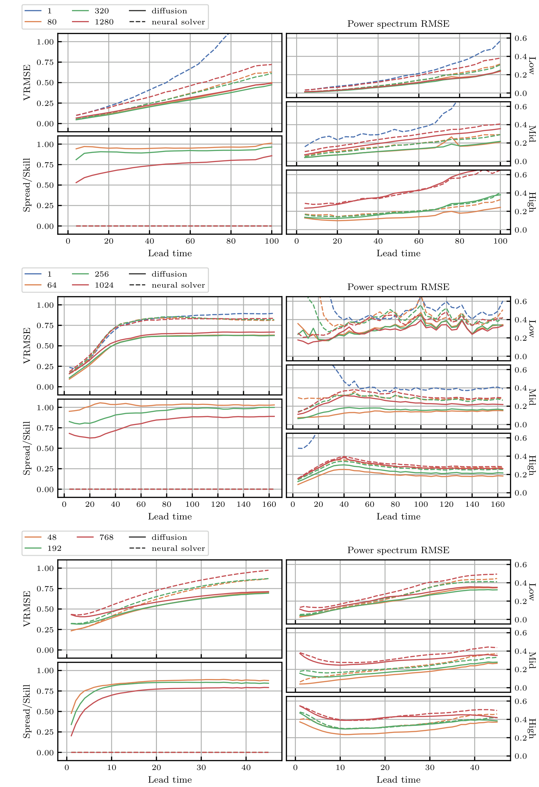
*Figure 8. Average evaluation metrics of latent-space emulation for the Euler (top), RB (center) and TGC (bottom) datasets. As expected from imperfect emulators, the emulation error grows with the lead time. However, the compression rate has little to no impact on emulation accuracy. Mid and high-frequency content is limited by the the autoencoder’s reconstruction capabilities. The spread- skill ratio [25, 77] drops slightly with the compression rate, which could be a sign of overfitting. The diffusion-based emulators are consistently more accurate than neural solvers.*

22

---

## Page 23

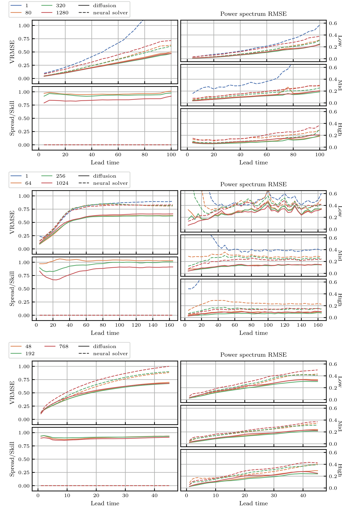
*Figure 9. Average evaluation metrics of latent-space emulation relative to the auto-encoded states \(D_\psi(E_\psi(x^i))\) for the Euler (top), RB (center) and TGC (bottom) datasets. As expected from imperfect emulators, the emulation error grows with the lead time. However, the compression rate has little to no impact on emulation accuracy. The spread-skill ratio \[25, 77\] drops slightly with the compression rate, which could be a sign of overfitting. The diffusion-based emulators are consistently more accurate than neural solvers.*

23

---

## Page 24

24

Figure 10: Examples of emulation at different compression rates (\(\div\)) for the Euler dataset. In this simulation, the system has open boundary conditions.

Figure 10: Examples of emulation at different compression rates (\(\div\)) for the Euler dataset. In this simulation, the system has open boundary conditions.

---

## Page 25

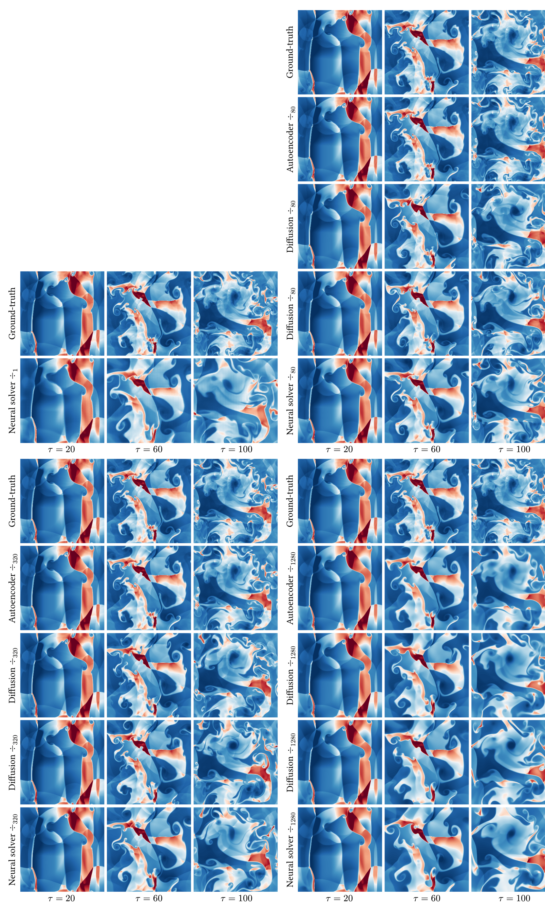
*Figure 11. Examples of emulation at different compression rates (\(\div\)) for the Euler dataset. In this simulation, the system has periodic boundary conditions.*

25

---

## Page 26

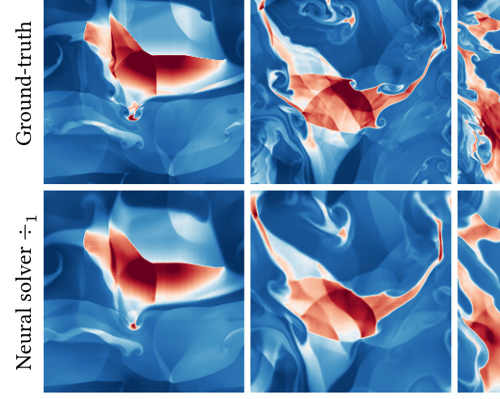

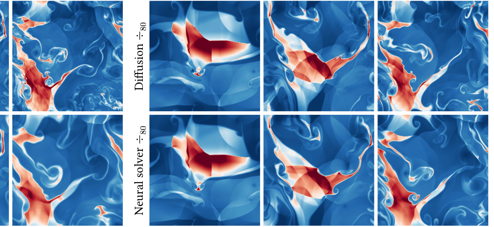

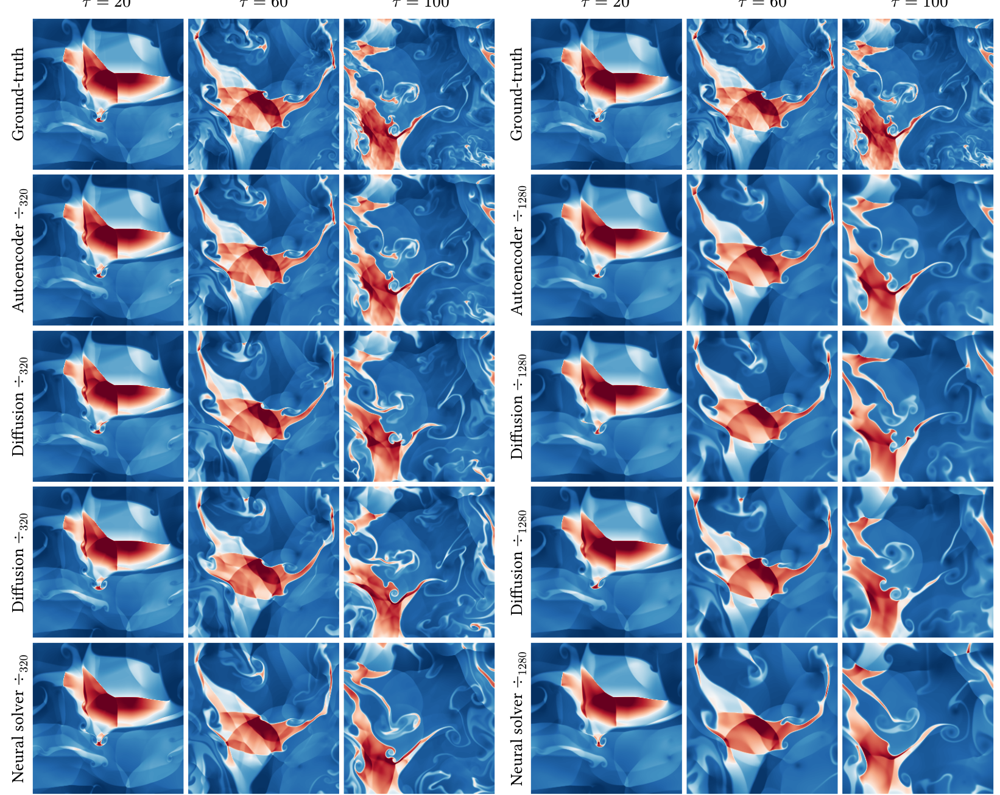
*Figure 12. Examples of emulation at different compression rates (\(\Dimark\)) for the Euler dataset. In this simulation, the system has periodic boundary conditions.*

26

---

## Page 27

\(\includegraphics{}\includegraphics{}\includegraphics{}\includegraphics{}\text{Figure 13. Examples of emulation at different compression rates (}\unknown\text{) for the Euler dataset. In this simulation, the system has periodic boundary conditions.}\unknown\)

27

---

## Page 28

\(\includegraphics{}\includegraphics{}\text{Figure 14. Examples of emulation at different compression rates (}\div\text{) for the Rayleigh-Bénard dataset. In this simulation, the fluid is in a low-turbulence regime (}\Re=10^6\text{).}\div\Re=10^6\)

28

---

## Page 29

\(\includegraphics{}\text{Figure 15. Examples of emulation at different compression rates (}\div\text{) for the Rayleigh-Bénard dataset. In this simulation, the fluid is in a high-turbulence regime (}\mathrm{Ra}=10^8\text{).}\div\)

29

---

## Page 30

\(\includegraphics{}\includegraphics{}\includegraphics{}\includegraphics{}\includegraphics{}\includegraphics{}\includegraphics{}\text{Figure 16. Examples of emulation at different compression rates (\textit{-}}\div\text{) for the Rayleigh-Bénard dataset. In this simulation, the fluid is in a low-turbulence regime (}Re=10^6\text{).}\div 64\div 64\)

---

## Page 31

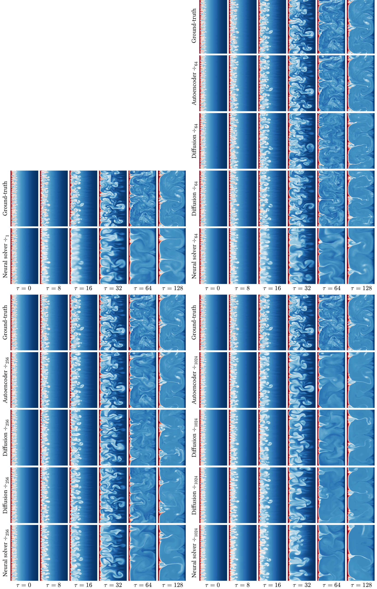
*Figure 17. Examples of emulation at different compression rates (\(\div\)) for the Rayleigh-Bénard dataset. In this simulation, the fluid is in a high-turbulence regime (Ra=108).*

31

---

## Page 32

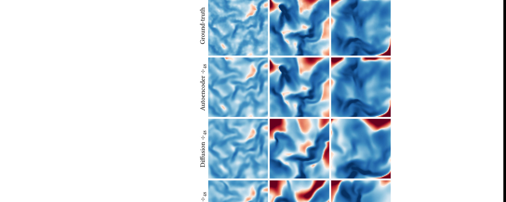

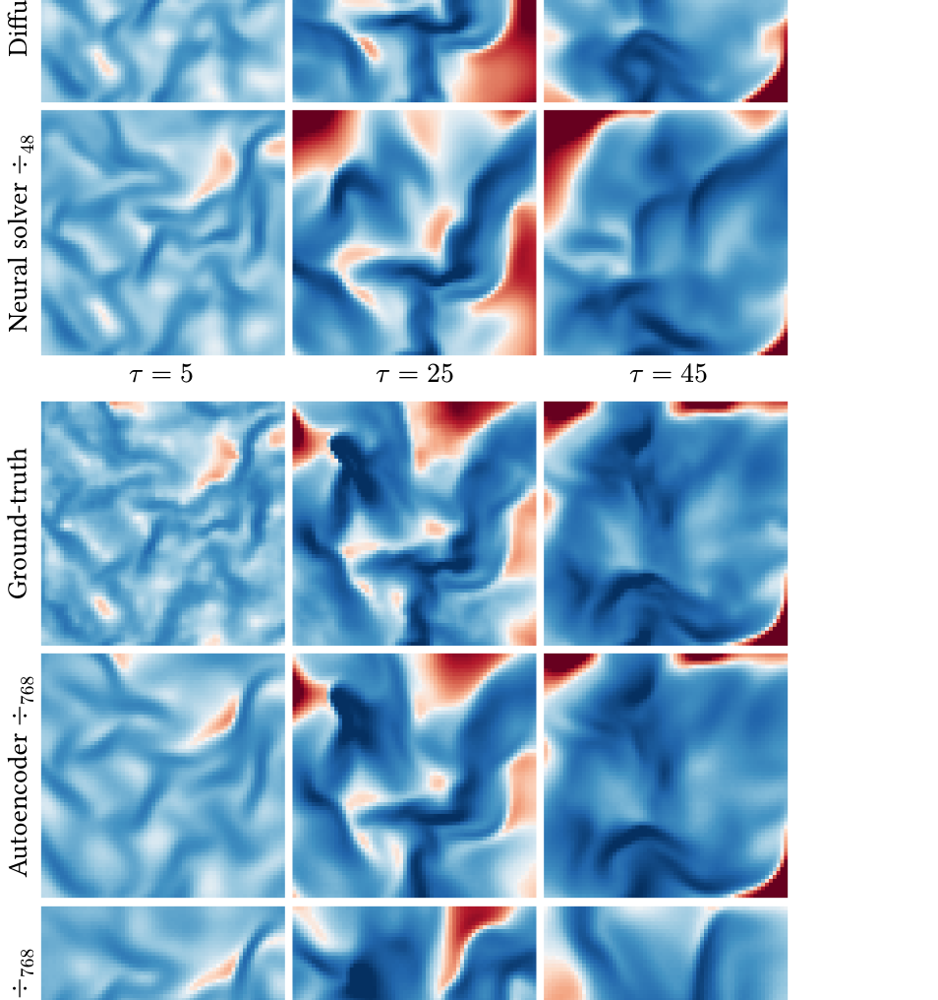

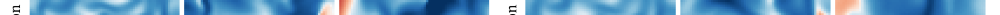

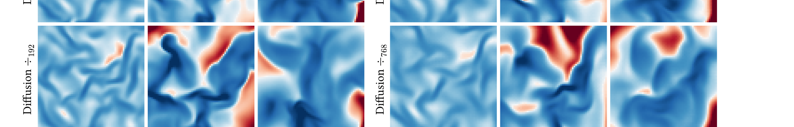
*Figure 18. Examples of emulation at different compression rates (\(\div\)) for the TGC dataset. In this simulation, the initial density is low and the initial temperature is low (\(\rho_0=0.445\), _T_0=10.0).*

32

---

## Page 33

\(\includegraphics{}\text{Figure 19. Examples of emulation at different compression rates (}\div\text{) for the TGC dataset. In this simulation, the initial density is medium and the initial temperature is high (}\rho_0=4.45\text{,}T_0=1000.0\text{).}\div\rho_0=4.45\)

33

---

## Page 34

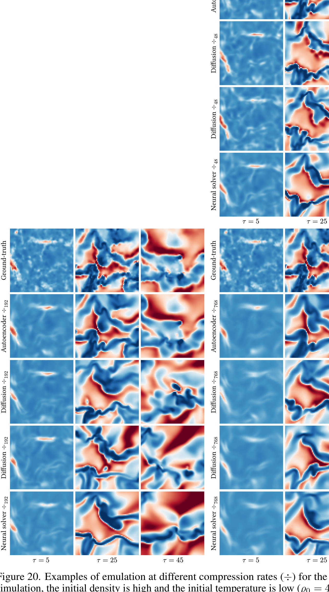

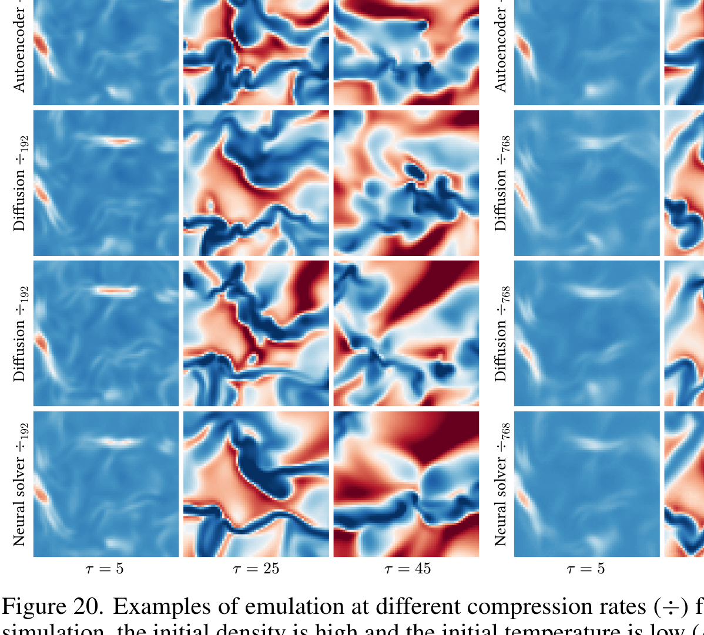
*Figure 20. Examples of emulation at different compression rates (\(\div\)) for the TGC dataset. In this simulation, the initial density is high and the initial temperature is low (\(\rho_0=44.5\), _T_0=10.0). Plainest vocals are*

34

---

## Page 35

\(\includegraphics{}\includegraphics{}\text{Figure 21. Examples of emulation at different compression rates (}\div\text{) for the TGC dataset. In this simulation, the initial density is high and the initial temperature is medium (}\rho_0=44.5\text{,}T_0=100.0\text{).}\rho_0=44.5\rho_0=100.0\)

35

---

